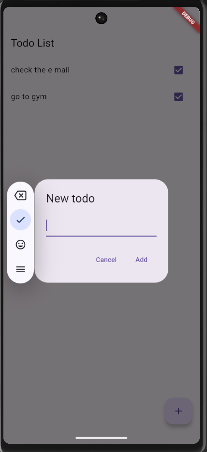
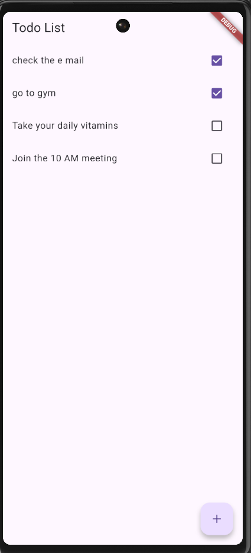

# Flutter Task Tracker

A simple and modern to-do list app built with Flutter.  
This project is based on a fork of an older to-do app, and has been updated to work with the latest Flutter and Android SDK versions.

## 🚀 Features

- ✅ Add, update, delete tasks
- 📁 Save tasks locally (File I/O)
- 📌 Mark tasks as completed
- 💡 Simple and clean UI
- 📱 Android compatible (updated to latest SDK versions)

## 🛠 What's Updated

This project was originally forked and then upgraded for modern compatibility:

- Upgraded `compileSdkVersion`, `minSdkVersion`, and other Android settings
- Resolved outdated Dart version warnings
- Updated Flutter dependencies in `pubspec.yaml`
- Replaced deprecated or broken code (e.g., MainActivity, AndroidManifest, etc.)
- Cleaned up project structure and icons

## 📷 Screenshots

### 🏠 Create Task Screen


### ✅ Task List Screen  


## 📦 Getting Started

1. Clone the repo:
   ```bash
   git clone https://github.com/yourusername/flutter-task-tracker.git
   ```
   
## License

[MIT](https://choosealicense.com/licenses/mit/)

